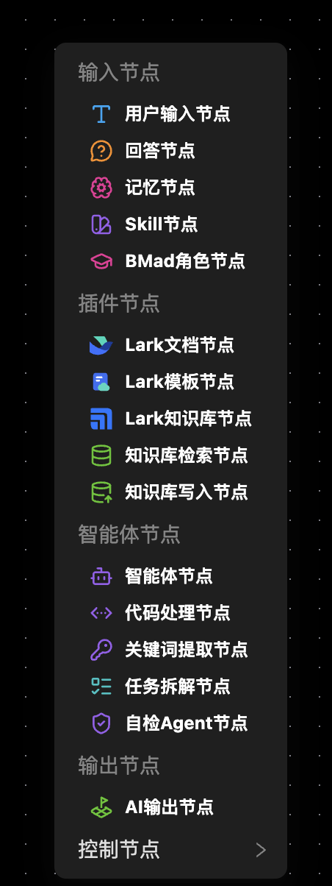

# 快速上手（Quickstart）

> **本指南带你从零开始，在 10 分钟内用可视化画布搭建并运行第一个 AI 工作流。**
>
> 如果您需要更加详细的说明，请参考 [深入使用指南](./detail.md)。

## 0. 认识界面

左侧导航栏包含六个功能页：

| 菜单 | 功能 |
|------|------|
| 工作流编排 | 主画布：拖拽节点、连线、运行工作流 |
| 规则与模型 | BMad 角色库、模型管理、提示词管理 |
| 知识库 | 知识库文档管理 |
| 执行结果 | 查看历史执行结果与统计 |
| 编辑器 | 项目文件编辑器（提示词 / 记忆 / 工作流 JSON / 技能） |
| 文档 | 本使用与学习指南（docs 目录，即当前页面） |

## 1. 如何创建节点

在工作流编排中，使用鼠标右击画布空白处，您可以添加以下类型的节点：

## 2. 保存工作流

当您完成工作流后，在左上角你可以看到四个按钮，点击最后一个保存工作流按钮对当前工作流进行保存。

## 3. 单步执行与运行调试

## 4. 导出真实工作流

你将得到一个能够在其他工具(Trae, Cursor, Codex, Claude Code 等)中运行的工作流文件可选格式：
1. JSON
2. YAML

## 4. 创建第一个工作流

以「用户输入 → 智能体 → 输出」的三节点链路为例：

1. **添加节点**：鼠标右键画布空白处（或使用工具栏），添加一个「用户输入」节点、一个「智能体」节点、一个「AI 输出」节点。
2. **连线**：从输入节点右侧的圆点拖出连线到智能体节点，再从智能体连到 AI 输出节点，形成 `userInput → agent → aiOutput` 链路。
3. **编辑节点**：点击节点，右侧编辑面板切换为对应配置。给「智能体」节点选择一个模型（规则与模型页需先配置模型）。
4. **输入内容**：双击「用户输入」节点，在编辑面板填写初始提示词（例如"总结这段文字"）。
5. **运行**：点击执行面板的「运行全部」，观察节点状态标签从灰 → 运行中 → 完成。
6. **查看结果**：切换到「输出」Tab 查看各节点输出；「结果」Tab 查看执行是否成功、耗时与 Token 消耗。

> 执行前若开启了 Spec 模式，需要至少为一个节点打上阶段标记（脚印按钮），否则执行会被中止。

## 5. 基础操作

- **添加节点** — 节点右侧的 `+` 按钮，下拉选择节点类型，自动连线到新节点
- **删除节点** — 编辑面板底部「删除」按钮，同时清理关联连线
- **编辑属性** — 点击节点，右侧面板切换；节点标题 / 描述可直接在面板头部编辑
- **拖拽布局** — 自由拖动节点调整画布布局；滚轮缩放、按住空白拖动画布
- **小地图** — 左下角 MiniMap 快速定位，Controls 提供缩放 / 适配视图 / 锁定

## 6. 单节点调试

开发工作流时不必每次都全量运行：

- **单节点执行**：节点上的 ▶ 按钮，只运行该节点（依赖未完成时会提示）
- **PIN 固定**：节点执行后点击 📌，把结果（连同累积上下文）存为 PIN；执行面板选择 PIN 节点后，从该节点下游开始运行，跳过上游
- **断点续跑**：执行到 Answer 节点等待输入时暂停；恢复后自动跳过已完成节点，从断点继续

## 7. 保存与导出

- **保存模板**：顶部「保存」按钮，把当前画布存入 `workflows/` 目录（JSON）
- **导入 / 导出**：支持粘贴 JSON 或拖拽 JSON 文件导入；导出为 JSON 或下载文件
- **导出 workflow.yml**：编排与验证通过后，导出为 spec 框架可消费的 `workflow.yml`，放入 Codex / Trae / Claude Code 执行

## 8. 常见问题

| 问题 | 处理 |
|------|------|
| 智能体节点报错"未配置模型" | 到「规则与模型」页创建模型（模型名 / API URL / API Key），再到节点面板选择 |
| 执行卡在 Answer 节点 | 该节点等待用户输入，编辑面板填写后继续 |
| Lark 节点失败 | 确认宿主机已 `lark-cli auth login` |
| 知识库检索无结果 | 确认已用「知识库存储」节点写入向量、embedding 模型维度匹配 |

## 下一步

- [项目概览](overview.md) — 平台定位与架构
- [深入指南](detail.md) — 21 种节点、执行引擎、PIN、BMad、优化策略
